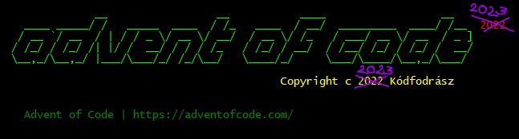

# Kodfodrasz.Advent-Of-Code-2023

<!--
<pre>
              __                 __           ____                  __
   ____ _____/ /   _____  ____  / /_   ____  / __/  _________  ____/ /__  2023
  / __ `/ __  / | / / _ \/ __ \/ __/  / __ \/ /_   / ___/ __ \/ __  / _ ]
 / /_/ / /_/ /| |/ /  __/ / / / /_   / /_/ / __/  / /__/ /_/ / /_/ /  __/
 \__,_/\__,_/ |___/\___/_/ /_/\__/   \____/_/     \___/\____/\__,_/\___/
 
                                           Copyright c 2023 Kódfodrász

  Advent of Code | https://adventofcode.com/
</pre>
-->

What is this? My solutions for the Advent of Code programming challenge in year 2023.
If you would like to know more about it, you can read about it here: <https://adventofcode.com/>

## It is that time of the year again...

... maybe this year I'll be patient enough to solve all the puzzles.

## Previous years

 - https://gitlab.com/kodfodrasz/advent-of-code-2018
 - https://gitlab.com/kodfodrasz/advent-of-code-2020
 - https://github.com/kodfodrasz/advent-of-code-2022

## TODO

There are lots of stuff missing from the library used to solve the puzzles.

### Missing algorithms from the library

#### Handy comparision combinators

 - Between (inclusive, exclusive, upper/lower inclusive)

#### String operations

Edit Distances:

 - Hamming distance (same length)
 - Lewenstein distance (any length)

#### Graph algorithms

Shortest path

 - Dijkstra
 - Floyd-Warschal
 - Bellman-Ford (shortest path, generates all paths from one node as a byproduct)

Circle detection

 - Floyd

Topological Sorting

 - Kahn's algorithm

#### Lists

 - Shuffle

#### Sets

 - Power set
 - Cartesian product[^1]
 - Cartesian product of single set on itself, except diagonal (Does this have a fancy name?)
 - Cartesian product single set on itself, only top triangular matrix, except diagonal (Does this have a fancy name?)

#### Number Theory

 - Largest Common Denominator
 - Least Common Multiple
 - Prime factorization
 - Prime sequence generation
 - Primality test
 - Coprimality test

#### Combinatorics

 - K-Combination
 - Power set
 - Binomial

#### Optimization

 - Hungarian method
 - Backtracking

[^1]: Magyarul/In Hungarian: Descartes-szorzat
